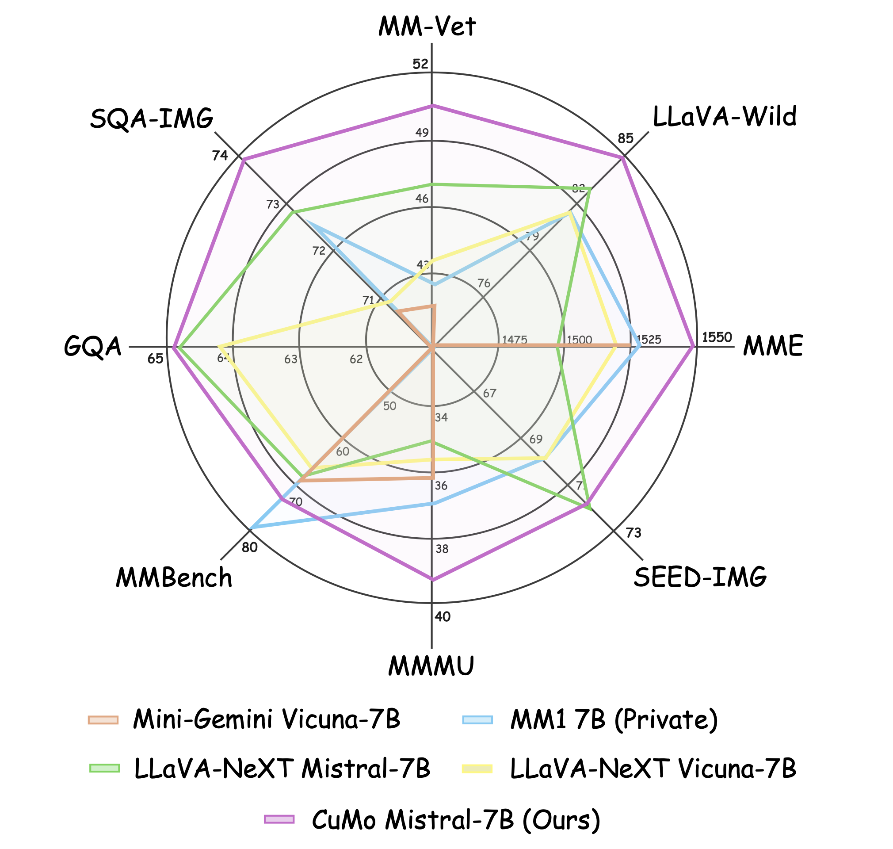
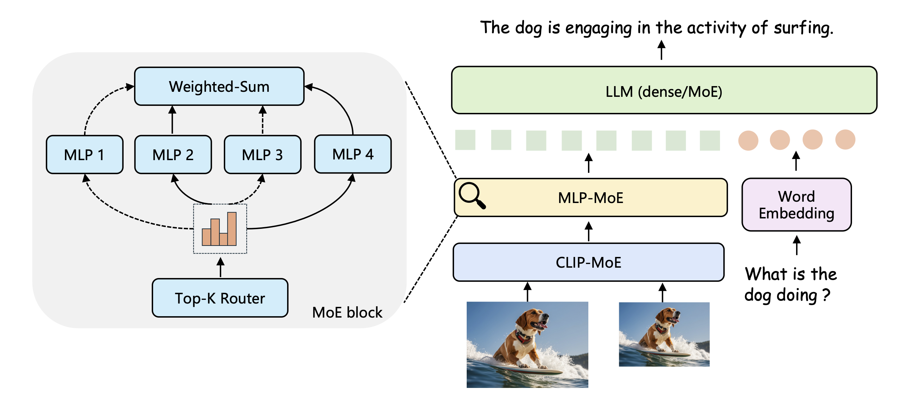

# CuMo: Scaling Multimodal LLM with Co-Upcycled Mixture-of-Experts
<a href='https://chrisjuniorli.github.io/project/CuMo/'></a>
<a href='https://arxiv.org/abs/2405.05949'></a>
<a href='https://huggingface.co/shi-labs/CuMo-mistral-7b'></a>
<a href='https://huggingface.co/datasets/shi-labs/CuMo_dataset'></a>
<a href='https://huggingface.co/spaces/jiachenl/CuMo-7b-zero'></a>

[Jiachen Li](https://chrisjuniorli.github.io/),
[Xinyao Wang](),
[Sijie Zhu](https://jeff-zilence.github.io/),
[Chia-wen Kuo](https://sites.google.com/view/chiawen-kuo/home),
[Lu Xu](),
[Fan Chen](),
[Jitesh Jain](https://praeclarumjj3.github.io/),
[Humphrey Shi](https://www.humphreyshi.com/home),
[Longyin Wen](https://scholar.google.com/citations?user=PO9WFl0AAAAJ&hl=en)

## Release
- [05/10] Check out the [Demo](https://huggingface.co/spaces/jiachenl/CuMo-7b-zero) based on Gradio zero gpu space.
- [05/09] Check out the [Arxiv](https://arxiv.org/abs/2405.05949) version of the paper!
- [05/08] We released **CuMo: Scaling Multimodal LLM with Co-Upcycled Mixture-of-Experts** with [project page](https://chrisjuniorli.github.io/project/CuMo/) and [codes](https://github.com/SHI-Labs/CuMo).

## Contents
- [CuMo: Scaling Multimodal LLM with Co-Upcycled Mixture-of-Experts](#cumo-scaling-multimodal-llm-with-co-upcycled-mixture-of-experts)
  - [Release](#release)
  - [Contents](#contents)
  - [Overview](#overview)
  - [Installation](#installation)
  - [Model Zoo](#model-zoo)
  - [Demo setup](#demo-setup)
    - [Gradio Web UI](#gradio-web-ui)
    - [CLI Inference](#cli-inference)
  - [Getting Started](#getting-started)
  - [Citation](#citation)
  - [Acknowledgement](#acknowledgement)
  - [License](#license)

## Overview

<div align=center>

</div>

In this project, we delve into the usage and training recipe of leveraging MoE in multimodal LLMs. We propose __CuMo__, which incorporates Co-upcycled Top-K sparsely-gated Mixture-of-experts blocks into the vision encoder and the MLP connector, thereby enhancing the capabilities of multimodal LLMs. We further adopt a three-stage training approach with auxiliary losses to stabilize the training process and maintain a balanced loading of experts.
CuMo is exclusively trained on open-sourced datasets and achieves comparable performance to other state-of-the-art multimodal LLMs on multiple VQA and visual-instruction-following benchmarks.

<div align=center>

</div>

## Installation
1. Clone this repo.
```bash
git clone https://github.com/SHI-Labs/CuMo.git
cd CuMo
```

2. Install dependencies.

*We used python 3.9 venv for all experiments and it should be compatible with python 3.9 or 3.10 under anaconda if you prefer to use it.*

```bash
venv:
python -m venv /path/to/new/virtual/cumo
source /path/to/new/virtual/cumo/bin/activate

anaconda:
conda create -n cumo python=3.9 -y
conda activate cumo

pip install --upgrade pip
pip install -e .
```

3. Install additional packages for training CuMo
```
pip install -e ".[train]"
pip install flash-attn --no-build-isolation
```

## Model Zoo
The CuMo model weights are open-sourced at Huggingface: 
| Model | Base LLM | Vision Encoder | MLP Connector | Download |
|----------|----------|----------|----------|----------------|
| CuMo-7B | Mistral-7B-Instruct-v0.2 | CLIP-MoE | MLP-MoE | [HF ckpt](https://huggingface.co/shi-labs/CuMo-mistral-7b) |
| CuMo-8x7B | Mixtral-8x7B-Instruct-v0.1 | CLIP-MoE | MLP-MoE | [HF ckpt](https://huggingface.co/shi-labs/CuMo-mixtral-8x7b) |

## Demo setup
### Gradio Web UI
We provide a Gradio Web UI based [demo](https://huggingface.co/spaces/jiachenl/CuMo-7b-zero). You can also setup the demo locally with
```bash
CUDA_VISIBLE_DEVICES=0 python -m cumo.serve.app \
    --model-path checkpoints/CuMo-mistral-7b
```
you can add `--bits 8` or `--bits 4` to save the GPU memory.

### CLI Inference
If you prefer to star a demo without a web UI, you can use the following commands to run a demo with CuMo-Mistral-7b on your terminal:
```Shell
CUDA_VISIBLE_DEVICES=0 python -m cumo.serve.cli \
    --model-path checkpoints/CuMo-mistral-7b \
    --image-file cumo/serve/examples/waterview.jpg
```
you can add `--load-4bit` or `--load-8bit` to save the GPU memory.


## Getting Started

Please refer to [Getting Started](docs/getting_started.md) for dataset preparation, training, and inference details of CuMo.

## Citation
```
@article{li2024cumo,
  title={CuMo: Scaling Multimodal LLM with Co-Upcycled Mixture-of-Experts},
  author={Li, Jiachen and Wang, Xinyao and Zhu, Sijie and Kuo, Chia-wen and Xu, Lu and Chen, Fan and Jain, Jitesh and Shi, Humphrey and Wen, Longyin},
  journal={arXiv:},
  year={2024}
}
```

## Acknowledgement

We thank the authors of [LLaVA](https://github.com/haotian-liu/LLaVA), [MoE-LLaVA](https://github.com/PKU-YuanGroup/MoE-LLaVA), [S^2](https://github.com/bfshi/scaling_on_scales),
[st-moe-pytorch](https://github.com/lucidrains/st-moe-pytorch), [mistral-src](https://github.com/mistralai/mistral-src) for releasing the source codes.

## License
[](LICENSE)
[](WEIGHT_LICENSE)

The weights of checkpoints are licensed under CC BY-NC 4.0 for non-commercial use. The codebase is licensed under Apache 2.0. This project utilizes certain datasets and checkpoints that are subject to their respective original licenses. Users must comply with all terms and conditions of these original licenses.
The content produced by any version of CuMo is influenced by uncontrollable variables such as randomness, and therefore, the accuracy of the output cannot be guaranteed by this project. This project does not accept any legal liability for the content of the model output, nor does it assume responsibility for any losses incurred due to the use of associated resources and output results.